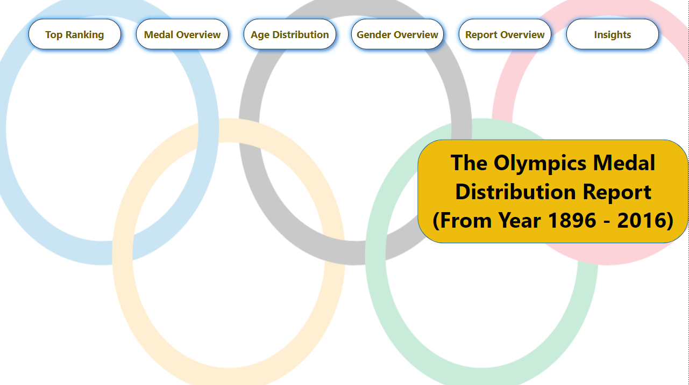
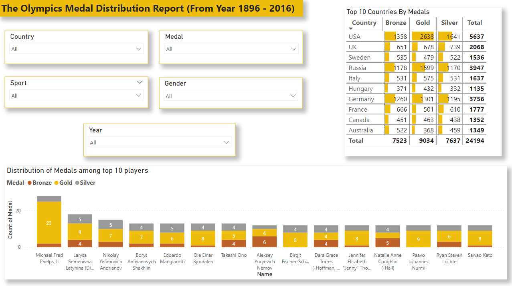
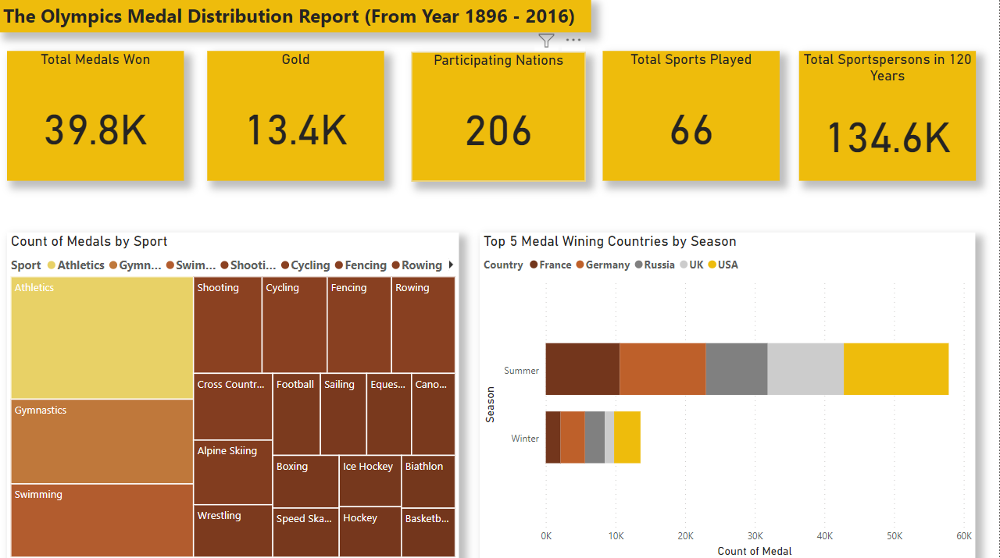
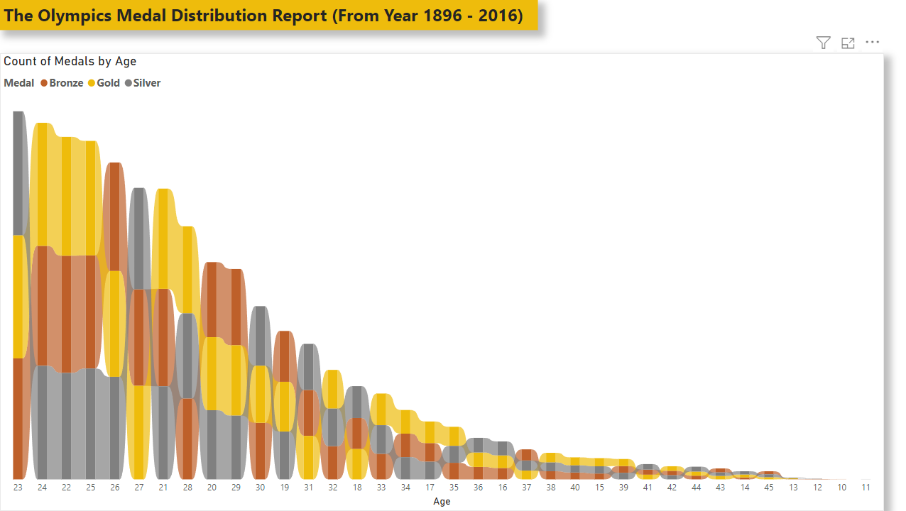
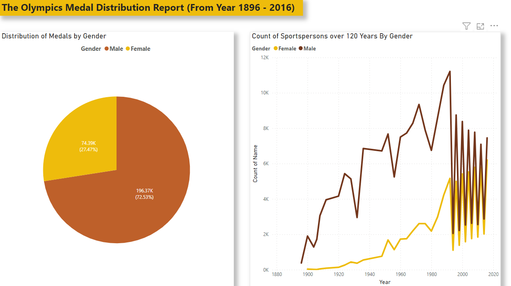
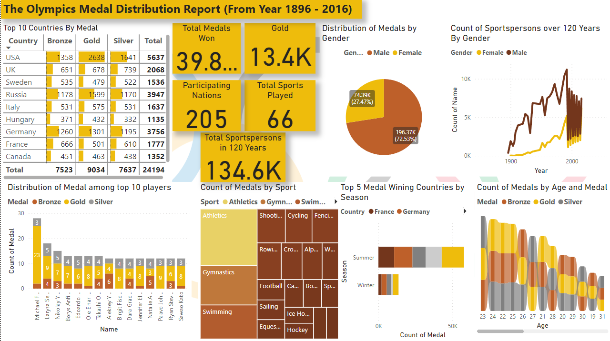
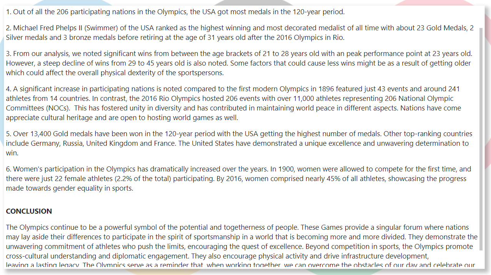

# Olympics-Dataset-Analysis

## Introduction

This is a Power BI report of actual data from the Olympic Games over a 120 year period from 1896 - 2016. The project is to analyze and derive insights from the overall performance of athletes and countries in 120 years. 

_The Olympics continue to be a powerful symbol of the potential and togetherness of people. These Games provide a singular forum where nations lay aside their differences to participate in the spirit of sportsmanship in a world that is becoming more and more divided. The unwavering commitment of athletes who push the limits, encourage the quest of excellence and world peace._

## Problem Statement

1.	What is the highest-ranking country with the most medals?
2.	Which sports person has won more medals in 120 years?
3.	How many gold medals have been won in 120 years? What country has gotten the most medals?
4.	At what age bracket do athletes perform optimally/win more medals? 
5.	How many nations participated through 120 years? 	
6.	With the advent of advocating for gender inclusion, what is the percentage of females to male Olympic participants by 2016?

## Skills/ Concepts Demostrated:

The following Power BI features were incorporated
- Power Query Transformation
- Bookmarking
- Page Navigation
- Filters
- Tooltips

## Visualization

The report comprises of 7 pages: 

1. Title Page
2. Top Ranking
3. Medal Overview
4. Age Distribution
5. Gender Overview
6. Report Overview
7. Insights

You can interact with the report [here](https://app.powerbi.com/groups/me/reports/e72eb156-7264-463b-8ad5-d8bb9b109732/ReportSectionb7b1be1a55c055d74412?experience=power-bi&clientSideAuth=0)

Features:
- 6 Page Navigator buttons with hovering effect that navigates to the page with a similar name.
- A Rounded rectangular shape element that embodies the title of the analysis. 

## Analysis

### Top Ranking Country 

1. Out of all the 206 participating nations in the Olympics, the USA got most medals in the 120-year 
Period.

2. A stacked column chart showing **Micheal Fred Phelps II (Swimmer)** of the **USA** ranked as the highest winning and most decorated medalist of all time with about 23 Gold Medals, 2 Silver medals and 3 bronze medals before retiring at the age of 31 years old after the 2016 Olympics in Rio. 

### Medal Overview 

3. Over 13,400 Gold medals have been won in the 120-year period with the USA getting the highest number of medals. Other top-ranking countries include Germany, Russia, United Kingdom and France. The United States have demonstrated a unique excellence and unwavering determination to win.
  
4. A significant increase in participating nations is noted compared to the first modern Olympics in 1896 featured just 43 events and around 241 athletes from 14 countries. In contrast, the 2016 Rio Olympics hosted 206 events with over 11,000 athletes representing 206 National Olympic Committees (NOCs). 
This has fostered unity in diversity and has contributed in maintaining world peace in different aspects. Nations have come to appreciate cultural heritage and are open to hosting world games as well.

### Age Distribution

5. From my analysis, I noted significant wins from between the age brackets of 21 to 28 years old with an optimal point at 23 years old. However, a steep decline of wins from 29 to 45 years old is also noted. Some factors that could cause less wins might be as a result of getting older which could affect the overall physical dexterity of the sportspersons.  

### Gender Overview

6.	Women's participation in the Olympics has dramatically increased over the years. In 1900, women were allowed to compete for the first time, and there were just 22 female athletes (2.2% of the total) participating. By 2016, women comprised nearly 45% of all athletes, showcasing the progress made towards gender equality in sports.

## 120-year Olympics at a glance

## Conclusion
Beyond competition in sports, the Olympics promote cross-cultural understanding and diplomatic engagement. They also encourage physical activity and drive infrastructure development, leaving a lasting legacy. The Olympics serve as a reminder that, when working together, we can overcome the obstacles of our day and celebrate our common humanity.

## Recommendation
To have a more holistic view of this analysis, I would advise that recent datasets is required for comparison and data driven decision making. 

